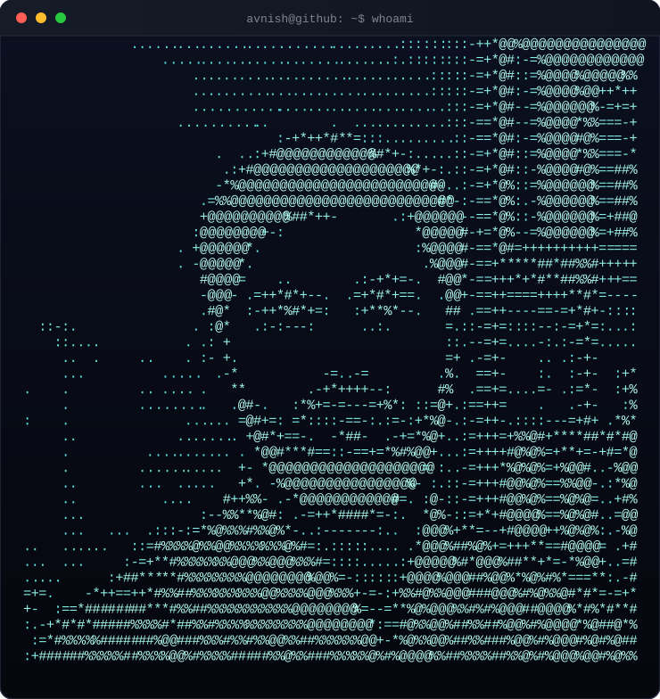

<div align="center">


</div>

<p align="center">
  <code>avnish@github</code> ~ $ ./contributions.sh --year
</p>

<p align="center">
  
</p>

<p align="center"><sub>🚀 rocket flies across the year and lights up each day as it passes — auto-updates daily via GitHub Actions</sub></p>

<br/>

<p align="center"><code>avnish@github</code> ~ $ ./whoami.sh</p>

<table>
<tr>
<td width="46%" valign="top">
  
</td>
<td width="54%" valign="top">

```
avnish@github
──────────────────────────────
Now      Software Developer (open to roles)
Study    MCA · KIET Group of Institutions · 2024–26
Prev     BCA · DN Degree College · 2020–23
Focus    Full-Stack + AI-integrated apps

── Stack ──────────────────────
Frontend   React.js, JavaScript, HTML5, CSS3
Backend    Node.js, Express.js, Java, Spring Boot
Database   MongoDB, MySQL
Tools      Git, GitHub Actions, Docker, Postman

── Highlights ─────────────────
• 3 production-style full-stack projects shipped
• 45+ DSA problems solved on LeetCode
• Certified: Python (Cisco) · Java OOP (Udemy)
```

</td>
</tr>
</table>

<br/>

<p align="center"><code>avnish@github</code> ~ $ ./stack.sh</p>

<p align="center">
  
  
  
  <br/>
  
  
  
  
  <br/>
  
  
  
  
</p>

<br/>

<p align="center"><code>avnish@github</code> ~ $ ./stats.sh</p>

<p align="center">
  
  
</p>

<p align="center">
  
</p>

<br/>

<p align="center"><code>avnish@github</code> ~ $ ls ./projects</p>

### 🧠 AI-Powered Interview Prep Platform
Full-stack platform (React · Node · Express · MongoDB) that uses an LLM API to generate role-specific mock interview questions and instant resume feedback. REST APIs for resume parsing + a prompt pipeline tailored by job role/experience, JWT-secured endpoints, response caching keeping average AI feedback turnaround under 2s.

### 🛒 Real-Time E-Commerce Platform
Full-stack e-commerce app (React · Node · Express · MongoDB) with product search, cart, and secure checkout via Razorpay/Stripe. Real-time order tracking with Socket.io, role-based access (customer/admin) with JWT, Redis caching cutting page load time ~35%.

### 📦 Enterprise Inventory & Order Management System
Java/Spring Boot backend (Controller-Service-Repository architecture) managing inventory, orders, and suppliers, backed by MySQL via JPA/Hibernate. Spring Security + JWT role-based authorization, Dockerized, 80%+ test coverage with JUnit/Mockito.

<br/>

<p align="center"><code>avnish@github</code> ~ $ ./connect.sh</p>

<p align="center">
  <a href="https://linkedin.com/in/iavnishkaushik"></a>
  <a href="https://github.com/Avnish-kaushik"></a>
  <a href="https://leetcode.com/avnish_codes"></a>
  <a href="mailto:kaushikavi7002@gmail.com"></a>
</p>

<p align="center"><sub>📍 Meerut, Uttar Pradesh, India</sub></p>
